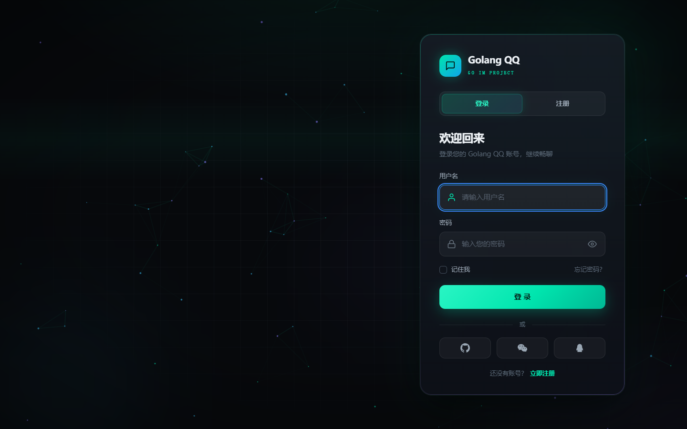
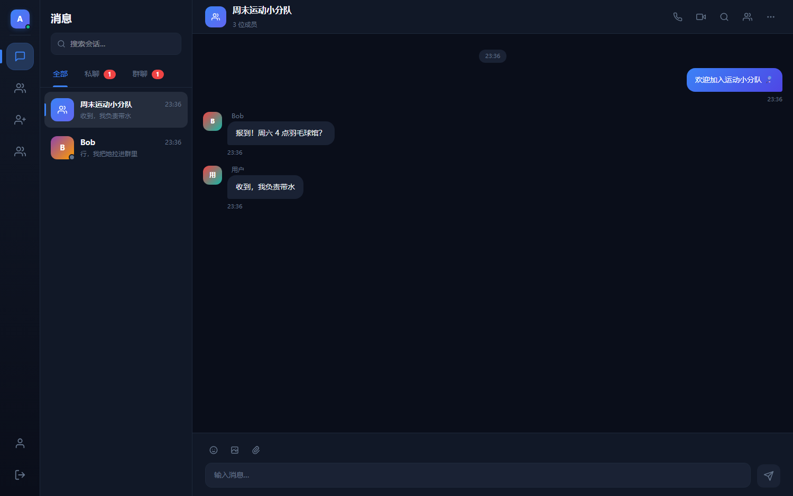

# Golang QQ —— 基于 Go + React 的即时通讯系统

一个仿 QQ 的即时通讯（IM）项目：**Go（Gin + WebSocket + MongoDB）后端 + React（Vite + Tailwind v4 + Zustand）前端**，支持单聊、群聊、好友、消息撤回、多账号切换、在线状态、输入指示，以及 WebRTC 音视频通话。

 

## ✨ 功能特性

### 聊天
- 单聊 / 群聊，会话列表（全部 / 私聊 / 群聊筛选）、未读徽章、消息搜索
- 文本消息、图片、文件上传、表情选择、消息撤回（2 分钟内）
- 在线状态、正在输入提示、已读回执、右键菜单（发消息 / 看资料 / 删好友）

### 好友
- 搜索用户 → **加好友**（申请 / 接受 / 拒绝 / 忙线），重复申请防抖
- 好友备注、好友列表实时刷新（WS 推送）、删除好友（双向移除）

### 通话（参考 QQ）
- **语音通话**：呼叫 → 振铃 → 接听 / 拒绝 → 通话计时 → 挂断
- **视频通话**：本地预览 + 远端大画面，静音 / 关摄像头切换
- 忙线自动拒绝、60 秒无人接听自动挂断、通话结束提示
- 基于 WebRTC（offer/answer/ICE 信令走 WebSocket 中继）

### 更多
- 顶栏"更多"菜单：发起群聊、添加好友、标为已读、清空聊天记录
- 多账号切换器（localStorage 持久化，账号间数据隔离）
- 深色主题 UI、键盘 `focus-visible` 焦点环、响应式三栏布局

## 🛠 技术栈

| 端 | 技术 |
|---|---|
| 前端 | React 19 · TypeScript · Vite · Tailwind CSS v4 · Zustand · WebRTC |
| 后端 | Go · Gin · gorilla/websocket · MongoDB（官方 driver） |
| 鉴权 | JWT（HTTP Bearer + WS query token） |

## 📁 项目结构

```
Golang_QQ/
├── server/                 # Go 后端
│   ├── main.go             # 入口：配置 → MongoDB → WS Hub → Gin
│   ├── config/             # 环境变量加载
│   ├── router/             # 路由注册
│   ├── middleware/         # JWT 鉴权、CORS
│   ├── handler/            # HTTP + WS 业务（auth/user/conversation/friend/group/upload/ws）
│   ├── model/              # MongoDB 集合与数据结构
│   └── ws/                 # Hub（连接注册/广播）+ Client（读/写泵、消息与通话信令处理）
├── web/                    # React 前端
│   └── src/
│       ├── pages/          # Login / Chat
│       ├── components/     # Sidebar、ChatArea、CallOverlay、FriendList 等
│       ├── store/          # Zustand：accounts/auth/chat/friend/call/ui
│       ├── hooks/          # useWebSocket（含通话事件分发）
│       ├── api/            # fetch 封装
│       └── styles/         # 全局样式与设计变量
├── tests/e2e/              # 无头浏览器自动化测试
├── docs/                   # 架构文档、UI 改造计划、截图
└── start.bat               # 一键启动（MongoDB + 后端 + 前端）
```

## 🚀 快速开始

### 一键启动

```bat
start.bat
```

脚本会依次启动 MongoDB（`D:\Golang\mongodb_data\db`）、Go 后端（`:8080`）和 Vite 前端（`:5173`），按任意键停止。

### 手动启动

```bash
# 1. MongoDB（端口 27017）
mongod --dbpath <你的数据目录> --port 27017

# 2. Go 后端
cd server
cp .env.example .env   # 如无则手动创建（PORT/MONGO_URI/MONGO_DB/JWT_SECRET/UPLOAD_DIR）
go run .

# 3. 前端
cd web
npm install
npm run dev
```

浏览器打开 **http://localhost:5173**，注册账号即可体验（可开两个浏览器窗口分别登录两个账号测试好友与通话）。

> 生产构建：`cd web && npm run build`，产物在 `web/dist`，可挂到任意静态服务器，API 通过 `/api`、`/ws`、`/uploads` 代理到后端。

## 🔌 核心协议

### REST API（节选）

| Method | Path | 说明 |
|---|---|---|
| POST | `/api/auth/register` `/api/auth/login` | 注册 / 登录（返回 JWT + User） |
| GET/PUT | `/api/users/me` | 我的资料 / 修改资料 |
| GET | `/api/users/search?q=` `/api/users/:id` | 搜索用户 / 用户详情 |
| GET/POST | `/api/conversations` | 会话列表 / 创建会话 |
| GET | `/api/conversations/:id/messages` | 消息历史 |
| DELETE | `/api/conversations/:id/messages/:mid` | 撤回消息 |
| GET | `/api/conversations/:id/messages/search?q=` | 搜索消息 |
| POST | `/api/groups` `/api/groups/:id/members` | 建群 / 添加成员 |
| POST | `/api/friends/request` | 发送好友申请 |
| GET/PUT | `/api/friends/requests` `/api/friends/requests/:id` | 申请列表 / 接受或拒绝 |
| GET/DELETE | `/api/friends` `/api/friends/:id` | 好友列表 / 删除好友 |
| PUT | `/api/friends/:id/remark` | 好友备注 |
| POST | `/api/upload` | 文件上传 |

### WebSocket 事件

- 客户端 → 服务端：`chat`、`typing`、`read`、`message_recall`、`heartbeat`、`call`、`call_event`
- 服务端 → 客户端：`new_message`、`typing`、`user_online/offline`、`friend_request`、`friend_accepted`、`message_recalled`、`call_incoming/call_accepted/call_rejected/call_ended/call_signal`

通话信令示例：

```jsonc
// 发起语音通话
{ "type": "call", "data": { "conversation_id": "...", "call_type": "voice" } }
// 接受 / 拒绝 / 挂断 / 媒体信令
{ "type": "call_event", "data": { "conversation_id": "...", "call_id": "...", "kind": "accept|reject|hangup|signal", "signal": { "type": "offer|answer|ice", "sdp": "...", "candidate": {...} } } }
```

## 🧪 测试

```bash
cd tests/e2e
npm install puppeteer-core
node friend-api-test.mjs    # 好友 API 矩阵（25 例）
node friend-add-e2e.mjs     # 加好友端到端（12 例）
node call-more-test.mjs     # 通话 + 图标功能（26 例）
```

详见 [tests/e2e/README.md](tests/e2e/README.md)。

## 📚 文档

- [架构文档](docs/architecture.md)（含前后端契约、通话信令、已知架构债与修复记录）
- [前端 UI 改造计划书](docs/frontend-redesign-plan.md)

## 📄 License

MIT
